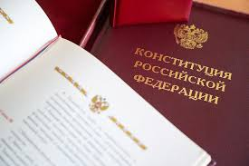
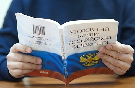
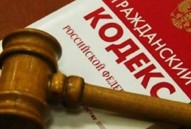
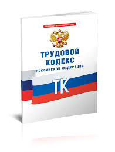

# Это заголовок первого уровня
## Это заголовок второго уровня
### Это заголовок третьего уровня

Конституция Российской Федерации– Основной закон Российской Федерации. Конституция имеет высшую юридическую силу, прямое действие и применяется на всей территории страны. Законы и иные правовые акты, принимаемые в Российской Федерации, не должны противоречить Конституции


**Уголовный кодекс Российской Федерации (УК РФ) — основной источник уголовного права и единственный нормативный акт, устанавливающий преступность и наказуемость деяний на территории Российской Федерации**


*Гражданский кодекс Российской Федерации (ГК РФ) — кодифицированный нормативно-правовой акт, регулирующий гражданско-правовые отношения, имеющий приоритет перед другими федеральными законами и иными нормативными правовыми актами в сфере гражданского права*


Кодексы
- Гражданский кодекс (ГК РФ)
- Жилищный кодекс (ЖК РФ)
- Налоговый кодекс (НК РФ)
- Трудовой кодекс (ТК РФ)
- Уголовный кодекс (УК РФ)
- Кодекс об административных правонарушениях (КоАП РФ)
- Бюджетный кодекс (БК РФ)
- Таможенный кодекс ЕАЭС
- Арбитражный процессуальный кодекс (АПК РФ)
- Земельный кодекс (ЗК РФ)

Законы
1. О защите прав потребителей
2. О банкротстве
3. Об исполнительном производстве
4. О персональных данных
5. О налогах на имущество физических лиц
6. ОКВЭД
7. Расходы организации ПБУ 10/99
8. О судебных приставах
9. О государственной регистрации недвижимости
10. Конституция РФ

Ссылка на источник: [Открыть Консультант Плюс](https://www.consultant.ru/)






| Страна  | Столица | Действующий глава |
| ------- | ------- | ----------------- |
| РФ  | Москва  | Путин В.В. |
| Финляндия  | Хельсинки  | Стубб А. |
| Норвегия | Осло | Эдвард Хамбро |
| Дания | Копенгаген | Метте Фредериксен |
| Франция | Париж | Эмманюэль Макрон |
| Португалия | Лиссабон | Марселу Ребелу де Соуза |
| Испания | Мадрид | Филипп VI |
| Германия | Берлин | Франк-Вальтер Штайнмайер |
| Бельгия | Брюссель | Александр Де Кро |
| Австрия | Вена | Александр Ван дер Беллен |
| Италия | Рим | Серджо Маттарелла |

Для применения таймера в приложении существует встроенный класс Timer. Чтобы создать объект класса Timer, нужно вставить: `Timer timer = new Timer();`

```c#
private void FieldsCheck(object sender, RoutedEventArgs e)
{
    if (string.IsNullOrEmpty(lastname.Text) || string.IsNullOrEmpty(firstname.Text) || string.IsNullOrEmpty(middlename.Text) || string.IsNullOrEmpty(phone.Text))
    {
        Error error = new Error("Заполните все поля!");
        error.Show();
    }
}
```
> "Обманщик в конечном итоге обманывает самого себя."  
> — Махатма Ганди

>> "Наука — это организованные знания, мудрость — это организованная жизнь."  
>> — Иммануил Кант

>>> "Если закрыть глаза, то становится темно."  
>>> — Джейсон Стэтхэм

---
---
---
