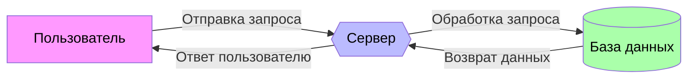
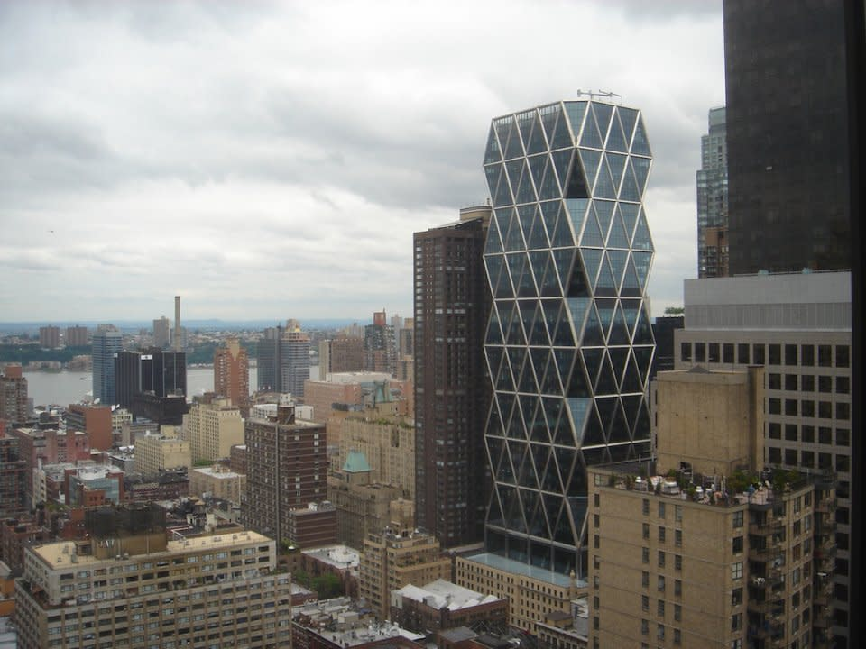
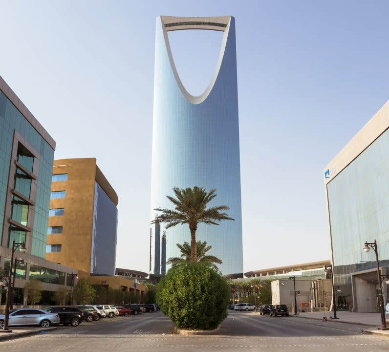
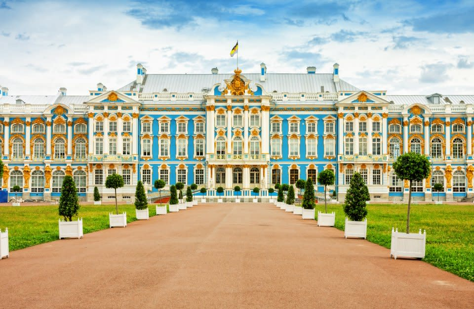

**Вариант 6**

- [**Формула для вычисления синуса угла**](#формула-для-вычисления-синуса-угла)
- [**Диаграмма потока данных**](#диаграмма-потока-данных)
- [**Слайдер для изображений**](#слайдер-для-изображений)
- [**Список сотрудников**](#список-сотрудников)
- [**Архитектура**](#архитектура)
- [**Список рецептов**](#список-рецептов)
- [**TypeScript и Scala**](#typescript-и-scala)
- [**Цитата**](#цитата)
- [**Эмодзи вдохновения**](#эмодзи-вдохновения)

## **Формула для вычисления синуса угла**

$\sin(\alpha) = \frac{\text{противолежащий катет}}{\text{гипотенуза}}$
или $\sin(\alpha) = sqrt(1 -(\cos(\alpha)^2)$

## **Диаграмма потока данных**


## **Слайдер для изображений**
<head>
    <style>
        .slider {
            position: relative;
            max-width: 100%;
            margin: auto;
            overflow: hidden;
        }
        .slides {
            display: flex;
            transition: transform 0.5s ease;
        }
        .slide {
            min-width: 100%;
            box-sizing: border-box;
        }
        .slide img {
            width: 100%;
            height: auto;
        }
        .left-right-arrows {
            position: absolute;
            top: 50%;
            width: 100%;
            display: flex;
            justify-content: space-between;
            transform: translateY(-50%);
        }
        .nav-button {
            background-color: rgba(0, 0, 0, 0.5);
            color: white;
            border: none;
            padding: 10px;
            cursor: pointer;
        }
    </style>
</head>
<body>
    <div class="slider">
        <div class="slides">
            <div class="slide"></div>
            <div class="slide"></div>
            <div class="slide"></div>
        </div>
        <div class="left-right-arrows">
            <button class="nav-button" onclick="prevSlide()">&#10094;</button>
            <button class="nav-button" onclick="nextSlide()">&#10095;</button>
        </div>
    </div>
    <script>
        let index = 0;
        function nextSlide() {
            showSlide(index + 1);
        }
        function prevSlide() {
            showSlide(index - 1);
        }
        function showSlide(n) {
            const slides = document.querySelector('.slides');
            const numberOfSlides = document.querySelectorAll('.slide').length;
            if (n >= numberOfSlides) {
                index = 0;
            } else if (n < 0) {
                index = numberOfSlides - 1;
            } else {
                index = n;
            }
            slides.style.transform = `translateX(${-index * 100}%)`;
        }
    </script>
</body>

## **Список сотрудников**
| Имя (по левому краю) | Должность (по центру)| Возраст (по правому краю) |
|:----------------- |:----------------: |-------------: |
| Шишкин Иван       | Ведущий программист      | 01.01.1994    |
| Полянский Петр       | Разработчик      | 15.02.1998    |
| Березовский Игорь     | Аналитик         | 23.03.1983    |
| Тимофеев Алексей   | Графический дизайнер         | 07.04.1990    |
| Самсонов Андрей     | Маркетолог       | 11.05.1987    |
| Ивлева Юлия    | Копирайтер       | 19.06.1992    |
| Гуряков Роман   | QA-инженер | 28.07.1986 |
| Кузнецова Светлана   | HR-менеджер      | 05.08.1985    |
| Староверов Дмитрий     | Системный администратор | 12.09.1991 |
| Миронова Мария  | Менеджер по продажам | 21.10.1988 |
| Филиппов Александр | Финансовый аналитик | 02.11.1984  |
| Турцева Анна      | Веб-разработчик  | 16.12.1995    |
| Фионова Ксения    | Контент-менеджер | 24.01.1993    |
| Макарова Дарья  | PR-менеджер      | 03.02.1989    |
| Гаспарян Артем     | UX/UI дизайнер   | 14.03.1994    |
| Игнатова Арина   | Операционный директор | 29.04.1982 |
| Бардин Арсений | Программист      | 10.05.1988    |
| Зиновьева Екатерина | Бухгалтер        | 22.06.1990    |
| Ворожейкина Ульяна     | Ассистент         | 08.07.1986    |
| Марьин Лев    | Программист        | 26.08.1992    |
| Бирюков Алексей| Охранник         | 18.09.1987    |

## **Архитектура**




## **Список рецептов**
* Выпечка
    1. Хлеб
        - Кабачковый хлеб
        - Бородинский хлеб
        - Французский хлеб
    2. Пицца
        - Пицца с беконом и грибами 
        - Пицца с колбасой, помидорами и сыром
        - Пицца с плавленным сыром
    3. Пирожные
        - Трубочки со сгущенкой
        - Брауни
        - Слойки с заварным кремом
        - Эклеры с вареной сгущенкой
    4. Кексы
        - Кекс на сливках
        - Кекс на сметане
    5. Торты
        - Торт из вафель
        - Бисквит на йогурте
        - "Наполеон"
* Салаты
    1. Овощные салаты
        - Салат из запеченных перцев
        - Маринованная капуста
        - Салат из кабачков с сыром
    2. Праздничные салаты
        - "Оливье" с копченой колбасой
        - Тарталетки с ананасом, сыром и курицей
        - "Гнездо глухаря"
* Гарниры
    1. Гарниры из картофеля
        - Картошка на решётке на мангале
        - Картофель с сыром и сметаной
        - Картофель фри в микроволновке
    2. Гарниры из риса
        - Рис, жареный на сковороде
        - Рис с брокколи и болгарским перцем
        - Рис с шампиньонами на сковороде
    3. Гарниры из гречки
        - Гречнево-рисовая каша
        - Гречка с грибами на сковороде


## **TypeScript и Scala**

```scala
object Greeting {
    def greetUser(name: String): String = {
        s"Привет, $name!"
    }

    def main(args: Array[String]): Unit = {
        val userName: String = "Мир"
        println(greetUser(userName))
    }
}
```

```typescript
    function greetUser(name: string): string {
        return `Привет, ${name}!`;
    }

    const userName: string = "Мир";
    console.log(greetUser(userName));
```

## **Цитата**
> "Будьте изменением, которое хотите видеть в мире."  
> — Махатма Ганди

## **Эмодзи вдохновения**

:heart_eyes: :smile: :star2: :collision: :fire: :sparkles: